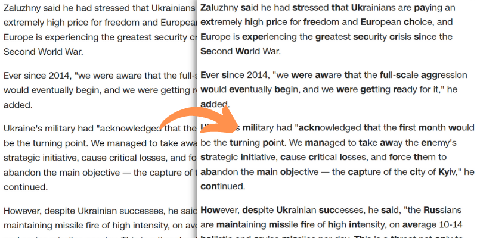

# Bread
by tobyxdd, modified by ltGuillaume: [Codeberg](https://codeberg.org/ltGuillaume) | [GitHub](https://github.com/ltGuillaume) | [Buy me a beer](https://buymeacoff.ee/ltGuillaume) 🍺

An open-source [Bionic reading](https://bionic-reading.com) userscript implementation.

## Getting started
1. Install a userscript manager in your browser (this script has been tested with [ViolentMonkey](https://violentmonkey.github.io/get-it/))
2. Open [bread.user.js](bread.user.js?raw=1) and confirm installation

### Configurable values
Key | Value | Description
-- | -- | --
`minWordLength` | `4` | Minimum length of a word to be "bionified"
`minTextLength` | `20` | Minimum length of a paragraph to be "bionified"
`boldRatio` | `.4` | Percentage of letters in each word that will be bolded
`processDyn` | `True` | Whether to process dynamically loaded content
`breadAllSites` | `True` | Whether to apply to all sites visited, or just the ones listed in breadSites
`breadSites` | `{}` | Restrict bread to a specific node per domain (use a CSS query, or `False` for default `body` node), and optionally inject custom CSS: `{ "domain_part" : "css_selector", "domain_part" : ["css_selector", "custom_css"] }`
`disabled` | `false` | Disable script
`keybind` | `c-r` | Keybind to trigger the script. Based on: https://violentmonkey.github.io/vm-shortcut/

You can change these values in your userscript manager.

## Credits
- Renato Casutt for the [Bionic Reading](https://bionic-reading.com) method
- [tobyxdd](https://github.com/tobyxdd) for his implementation of Bionic Reading ([get it on OpenUserJS](https://openuserjs.org/scripts/tobyxdd/Bread))
- [Bionic Eye](https://www.flaticon.com/free-icon/bionic-eye_9485741) icon by [Freepik](https://www.flaticon.com/authors/freepik)
